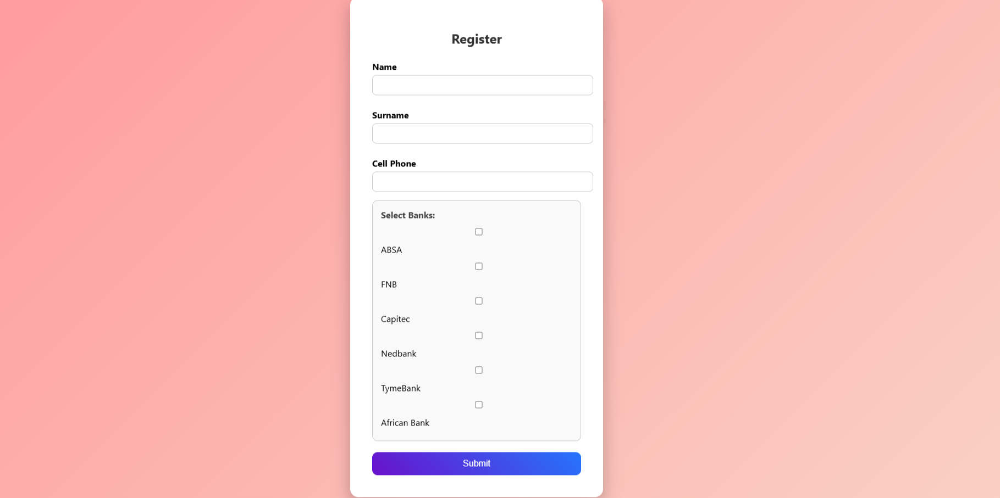
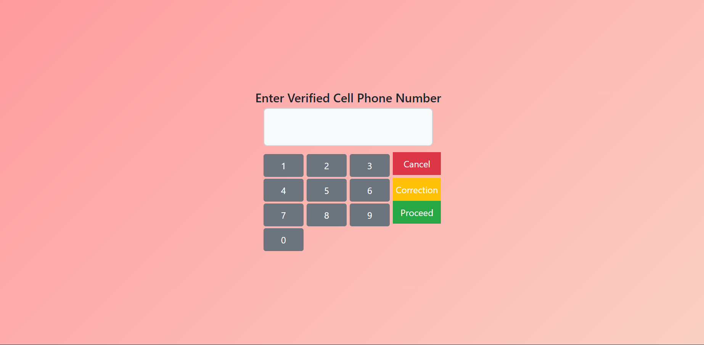
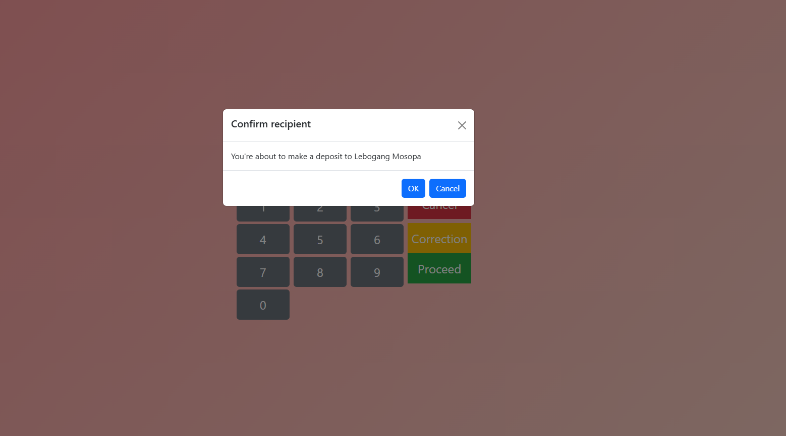
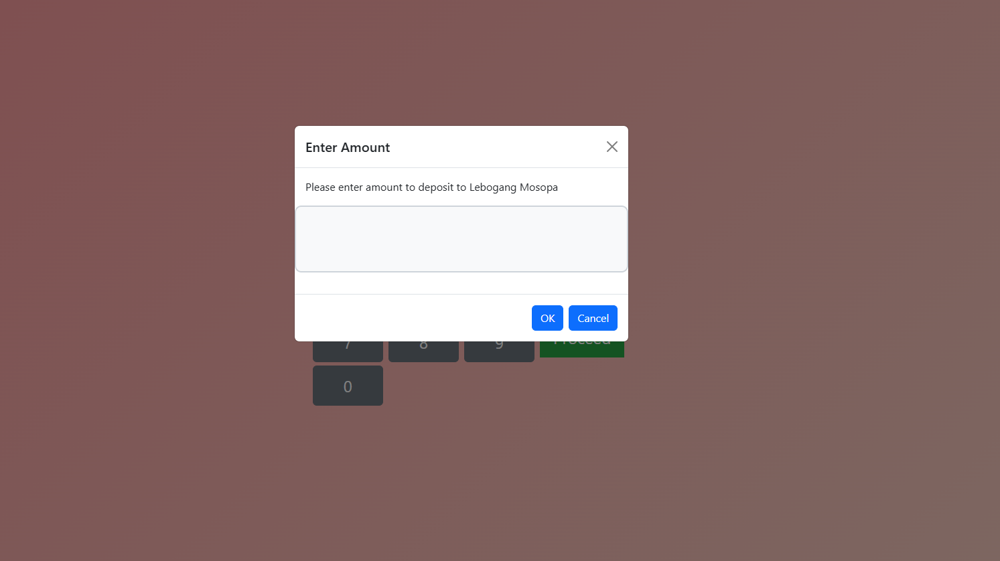
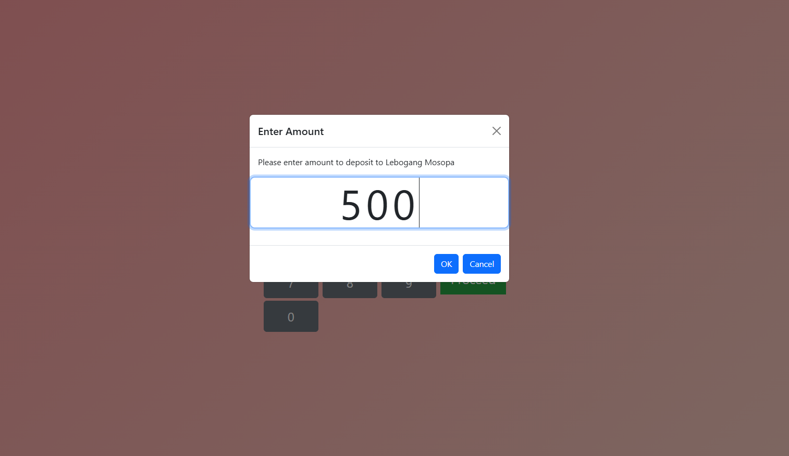
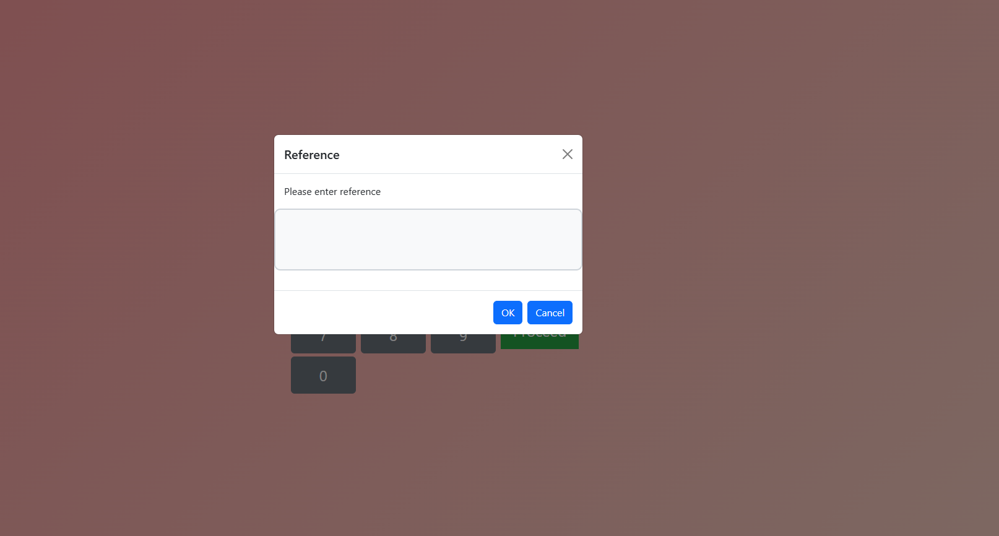
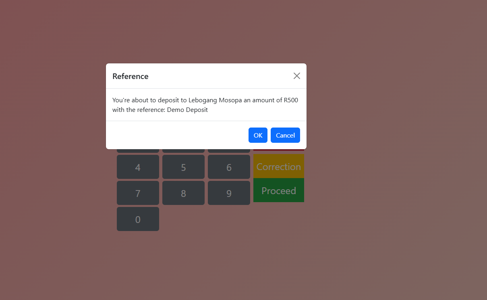
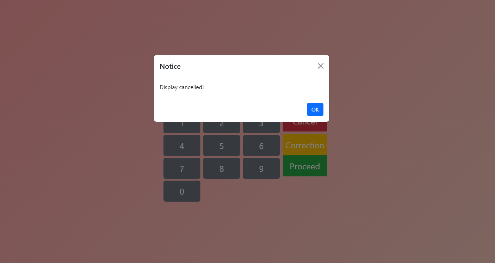
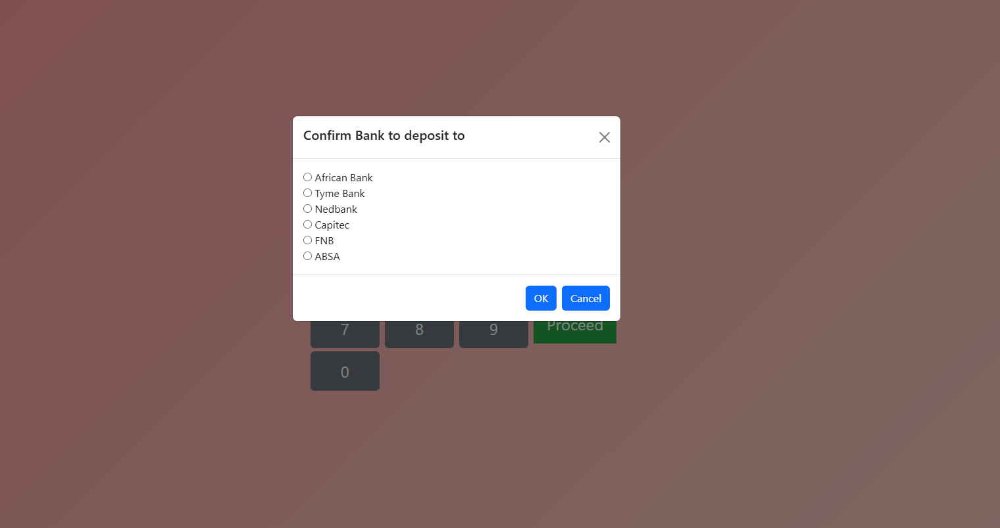
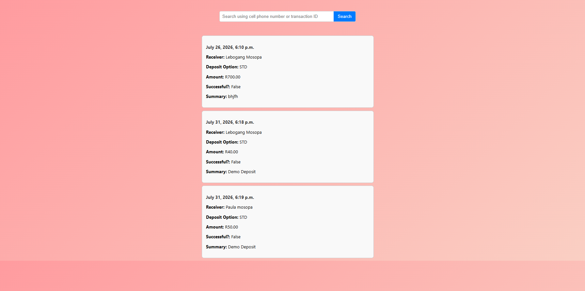

Dial and Pay ™ 

 

Dial and Pay is an application that is designed to allow users to make deposits on tellers using only the recipients' cell phone number. 

Overview 

Dial and Pay is a banking solution designed to simplify cash deposits by allowing users to send funds using only a recipient's cellphone number. The system eliminates the need for account numbers during deposits and enables seamless fund transfers across participating banks. 

Users can select their preferred bank and deposit method while recipients receive deposited funds through their linked Dial and Pay banking profile. The platform aims to make deposits faster, more accessible, and more convenient for everyday banking customers. 

 

Features 

 

Register Dial and Pay user 

Select Dial and Pay bank and account 

Search transactions by either transaction Id or cell phone number 

Choose deposit option-between standard deposit or Dial and Pay deposit 

Verify the recipient with the depositor 

Make deposits 

Enter recipient's number 

Enter amount  

Enter reference 

Choose preferred bank account (if using Dial and Pay deposit option) 

View transactions 

Great UI features and responsive design 

 

Built with 

 

Backend 

Django 

Python 

 

Frontend 

HTML5 

CSS3 

 

Database 

SQLite (Default Django Database) 

 

Development Tools 

Git 

GitHub 

Visual Studio Code 

 

Screenshots 

 

 

 

Please register first to be able to fully interact with Dial and Pay. On the welcome screen there are 3 options that a user will can choose from, to either register, make deposit or view journal. 

 

This is the registration page where the user will be prompt to save their information to be able to continue and make deposits. 

 

The deposit option is further divided in 2 subsections. To make a standard deposit (without selecting the recipient bank) or Dial and Pay (selecting the recipient bank).  

 

 

 

On both deposit options, the user will be prompted to enter the recipient's cell phone number.  

 

The recipient will be verified in the screenshot below. 
The user will be prompted to deposit. This feature is only made available for prototype purposes. The actual feature will just count the notes inserted by the user in the ATM.  

 

 

 

The dial and Pay deposit will prompt the user to select the bank they wish to deposit funds into. 

 

 

 

The view journal function is to display deposits that happened. They can either be searched by recipient's cell phone number or transaction id and or prompt the system to display all transactions. 

 

 

Getting started 

 

You can run Dial and Pay either locally using Python or through Docker. 

Option 1: Local Installation 

 

Prerequisites 

 

Python 3.10+ 

Git 

pip 

 

Clone the repository: 

git clone https://github.com/KXC2/DAP.git 

Navigate to the project directory: 

cd DAP 

Create a virtual environment: 

python -m venv venv 

Activate the virtual environment 

Windows 

Livenv\Scripts\activate 

Mac/Linux: 

source venv/bin/activate 

Install dependencies: 

pip install -r requirements.txt 

Apply migrations: 

python manage.py migrate 

Run the development server: 

python manage.py runserver 

Open: 

http://127.0.0.1:8000 

 

🐳 Option 2: Docker Installation 

 

Clone Repository 

git clone https://github.com/KXC2/DAP.git 

Navigate to the project directory: 

cd DAP 

Build and start the application: 

docker compose up --build 

Open: 

http://localhost:8000 

Stop the container: 

docker compose down 

 

Future improvements 

Will flag deposits and accounts for investigation 

Verifies if deposit was successful or not 

Allows user to register their Dial and Pay account 

Author 

Lebogang Phoenix Mosopa 

Github: https://github.com/KXC2 

LinkedIn: https://www.linkedin.com/in/lebogang-mosopa-51aa69191/ 

 
